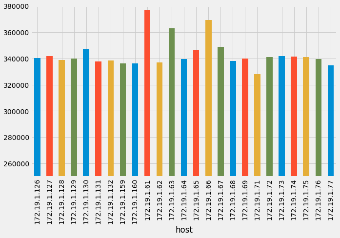

# spark-pyrest
A simple python package for querying Apache Spark's REST API: 

* simple interface
* returns DataFrames of task metrics for easy slicing and dicing
* easily access executor logs for post-processing. 

## Installation and dependencies

`spark-pyrest` uses [`pandas`](http://pandas.pydata.org/). 

To install:

```
$ git clone https://github.com/rokroskar/spark-pyrest.git
$ cd spark-pyrest
$ python setup.py install
```

## Usage

### Initializing the `SparkPyRest` object with a host address
```python
from spark_pyrest import SparkPyRest

spr = SparkPyRest(host)
```

### Get the current app
```python
spr.app
u'app-20170420091222-0000'
```

### Get the running/completed stages
```python
spr.stages

[(2,
  u'groupByKey '),
 (1,
  u'partitionBy'),
 (0,
  u'partitionBy'),
 (4, u'runJob at PythonRDD.scala:441'),
 (3,
  u'distinct')]
```

### Get task metrics for a stage
```
pr.tasks(1)
```
<table border="1" class="dataframe">
  <thead>
    <tr style="text-align: right;">
      <th></th>
      <th>bytesWritten</th>
      <th>executorId</th>
      <th>executorRunTime</th>
      <th>host</th>
      <th>localBytesRead</th>
      <th>remoteBytesRead</th>
      <th>taskId</th>
    </tr>
  </thead>
  <tbody>
    <tr>
      <th>0</th>
      <td>3508265</td>
      <td>33</td>
      <td>354254</td>
      <td>172.19.1.124</td>
      <td>0</td>
      <td>112</td>
      <td>25604</td>
    </tr>
    <tr>
      <th>1</th>
      <td>3651003</td>
      <td>56</td>
      <td>353554</td>
      <td>172.19.1.74</td>
      <td>0</td>
      <td>112</td>
      <td>24029</td>
    </tr>
    <tr>
      <th>2</th>
      <td>3905955</td>
      <td>9</td>
      <td>347724</td>
      <td>172.19.1.62</td>
      <td>0</td>
      <td>111</td>
      <td>19719</td>
    </tr>
    </tbody>
</table>

### Check some properties aggregated by host/executor
```python
host_tasks = spr.tasks(1)[['host','bytesWritten','remoteBytesRead','executorRunTime']].groupby('host')

host_tasks.describe()
```
<table border="1" class="dataframe">
  <thead>
    <tr style="text-align: right;">
      <th></th>
      <th></th>
      <th>bytesWritten</th>
      <th>executorRunTime</th>
      <th>remoteBytesRead</th>
    </tr>
    <tr>
      <th>host</th>
      <th></th>
      <th></th>
      <th></th>
      <th></th>
    </tr>
  </thead>
  <tbody>
    <tr>
      <th rowspan="8" valign="top">172.19.1.100</th>
      <th>count</th>
      <td>1.270000e+02</td>
      <td>127.000000</td>
      <td>1.270000e+02</td>
    </tr>
    <tr>
      <th>mean</th>
      <td>6.436659e+06</td>
      <td>337587.913386</td>
      <td>3.230165e+06</td>
    </tr>
    <tr>
      <th>std</th>
      <td>1.744411e+06</td>
      <td>114722.662028</td>
      <td>5.590263e+05</td>
    </tr>
    <tr>
      <th>min</th>
      <td>0.000000e+00</td>
      <td>0.000000</td>
      <td>1.098278e+06</td>
    </tr>
    <tr>
      <th>25%</th>
      <td>6.426009e+06</td>
      <td>292290.000000</td>
      <td>2.967360e+06</td>
    </tr>
    <tr>
      <th>50%</th>
      <td>6.805269e+06</td>
      <td>348174.000000</td>
      <td>3.315189e+06</td>
    </tr>
    <tr>
      <th>75%</th>
      <td>7.160529e+06</td>
      <td>420091.500000</td>
      <td>3.582200e+06</td>
    </tr>
    <tr>
      <th>max</th>
      <td>8.050828e+06</td>
      <td>500831.000000</td>
      <td>4.775107e+06</td>
    </tr>
    <tr>
      <th rowspan="8" valign="top">172.19.1.101</th>
      <th>count</th>
      <td>1.300000e+02</td>
      <td>130.000000</td>
      <td>1.300000e+02</td>
    </tr>
    <tr>
      <th>mean</th>
      <td>6.470575e+06</td>
      <td>335401.584615</td>
      <td>3.178066e+06</td>
    </tr>
    <tr>
      <th>std</th>
      <td>1.725755e+06</td>
      <td>115268.286668</td>
      <td>6.332040e+05</td>
    </tr>
    <tr>
      <th>min</th>
      <td>0.000000e+00</td>
      <td>0.000000</td>
      <td>0.000000e+00</td>
    </tr>
    <tr>
      <th>25%</th>
      <td>6.534020e+06</td>
      <td>290462.750000</td>
      <td>2.965009e+06</td>
    </tr>
    <tr>
      <th>50%</th>
      <td>6.880597e+06</td>
      <td>356160.000000</td>
      <td>3.327600e+06</td>
    </tr>
    <tr>
      <th>75%</th>
      <td>7.197086e+06</td>
      <td>407338.750000</td>
      <td>3.558479e+06</td>
    </tr>
    <tr>
      <th>max</th>
      <td>7.983406e+06</td>
      <td>515372.000000</td>
      <td>4.526526e+06</td>
    </tr>
    </tbody>
    </table>

#### Plot the data

```python
mean_runtime = host_tasks.mean()['executorRunTime']

mean_runtime.plot(kind='bar')
```



### Grab the log of an executor
If your application prints its own metrics to 
stdout/stderr, you need to be able to grab the executor logs to see these metrics. The logs are located on the hosts that make up your cluster, so accessing them programmatically can be tedious. You can see them through the Spark web UI of course, but processing them that way is not really useful. Using the `executor_log` method of `SparkPyRest`, you can grab the full contents 
of the log for easy post-processing/data extraction. 

```python
log = spr.executor_log(0)
print log
```
```
==== Bytes 0-301839 of 301839 of /tmp/work/app-20170420091222-0000/0/stderr ====
Using Spark's default log4j profile: org/apache/spark/log4j-defaults.properties
17/04/20 09:12:23 INFO CoarseGrainedExecutorBackend: Started daemon with process name: 14086@x04y08
17/04/20 09:12:23 INFO SignalUtils: Registered signal handler for TERM
17/04/20 09:12:23 INFO SignalUtils: Registered signal handler for HUP
17/04/20 09:12:23 INFO SignalUtils: Registered signal handler for INT
17/04/20 09:12:23 WARN NativeCodeLoader: Unable to load native-hadoop library for your platform... using builtin-java classes where applicable
17/04/20 09:12:23 INFO SecurityManager: Changing view acls to: roskar
17/04/20 09:12:23 INFO SecurityManager: Changing modify acls to: roskar
17/04/20 09:12:23 INFO SecurityManager: Changing view acls groups to: 
17/04/20 09:12:23 INFO SecurityManager: Changing modify acls groups to: 
```

## Contributing

Please submit an issue if you discover a bug or have a feature request! Pull requests also very welcome. 
